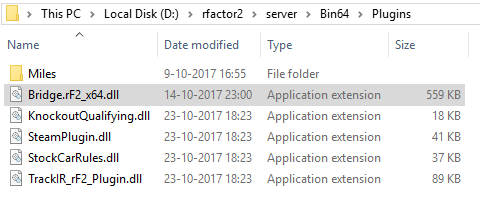
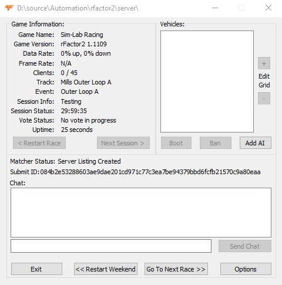
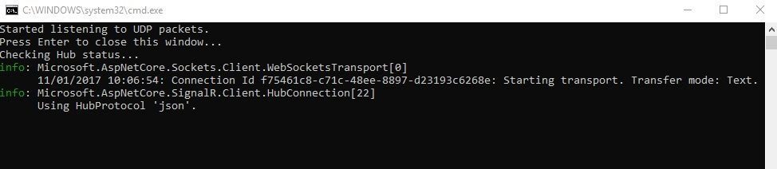
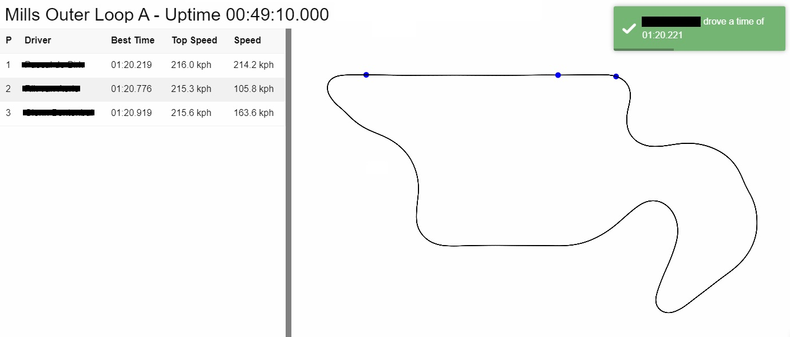

# Sim Telemetry Suite
The Sim Telemetry Suite is a solution that can receive data from your simracing server and show it in a dashboard.

## Features
* Generate track map based on live driver positions
* Show live driver timing details
* Pan and zoom the track view
* Notifications upon lap completion

## Components
An overview of all the components that make up the Sim Telemetry Suite.

### Bridge
The bridge is a little piece of software that catches all the telemetry data from the simulation and pushes it in a json string through a UDP socket. The first implementation is done for rFactor 2, but the Bridge solution can be expanded for other simulations. Building the solution results in a DLL which can be installed under the plugin directory:



### rFactor 2 Dedicated Server
The server software runs the Bridge plugin, which broadcasts UDP messages to a specific port on the same network:



### Receiver
The receiver catches the UDP messages sent by the server, then sends them through SignalR to the dashboard:



### Dashboard
The dashboard receives the data to be displayed and does its own magic:



## Technologies
The following technologies are used:
* [rFactor2 Plugin Example](https://www.studio-397.com/modding-resources/) (C++)
* .NET Core with ASP.NET Core (C#)
* ASP.NET Core SignalR (C#)
  * [Server](https://www.nuget.org/packages/Microsoft.AspNetCore.SignalR)
  * [Client](https://github.com/aspnet/SignalR)
* JavaScript libraries/frameworks
  * [Node.js](https://nodejs.org/en/) with [NPM](https://www.npmjs.com/)
  * [Paper.js](http://paperjs.org/)
  * [Vue.js](https://vuejs.org/)
  * [Foundation-sites](https://foundation.zurb.com/sites.html)
  * [JQuery](https://jquery.com/)
  * [eventemitter3](https://github.com/primus/eventemitter3)
  * [toastr](https://github.com/CodeSeven/toastr)

## Contribution
Want to contribute to the project? Take a look at open issues if you like. I'm also open for code reviews and pull requests. Looking forward to your feedback and/or improvements to the project!

### Prerequisites
```
SteamCMD
rFactor2 Dedicated Server + Content (At least one track, vehicle, mod)
Visual Studio 2017
Node.js
.NET Core 2.0
```

### Installing
Section in progress...
```
Place [Bridge] output in Bin64
Start [Dashboard] with [dotnet run]
Start [Receiver] with [dotnet run]
```

### Running the tests
Execute the following commands from 'Receiver.Tests':
```
dotnet restore
dotnet xunit
```

## Authors
* **André Geuze** - *Initial work* - [andregeuze](https://github.com/andregeuze)

See also the list of [contributors](https://github.com/andregeuze/Sim-Telemetry-Suite/contributors) who participated in this project.

## License
This project is licensed under the MIT License - see the [LICENSE.md](LICENSE.md) file for details

## Acknowledgements
* Thanks to Image Space Incorporated and Studio397 for delivering us the next-gen racing simulation the world needs :)
* Inspired by LiveRacers.info